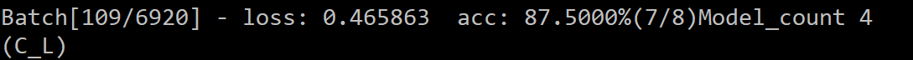

<!--
 * @Author: skyang33790 3379025836@qq.com
 * @Date: 2026-01-10 10:42:37
 * @LastEditors: skyang33790 3379025836@qq.com
 * @LastEditTime: 2026-01-12 14:02:50
 * @FilePath: \cnn-lstm-bilstm-deepcnn-clstm-in-pytorch\README.md
 * @Description: 这是默认设置,请设置`customMade`, 打开koroFileHeader查看配置 进行设置: https://github.com/OBKoro1/koro1FileHeader/wiki/%E9%85%8D%E7%BD%AE
-->
路径：cd /e/0KD/repos/cnn-lstm-bilstm-deepcnn-clstm-in-pytorch
虚拟环境
conda activate C_L
直接运行main.py即可
结果：
1